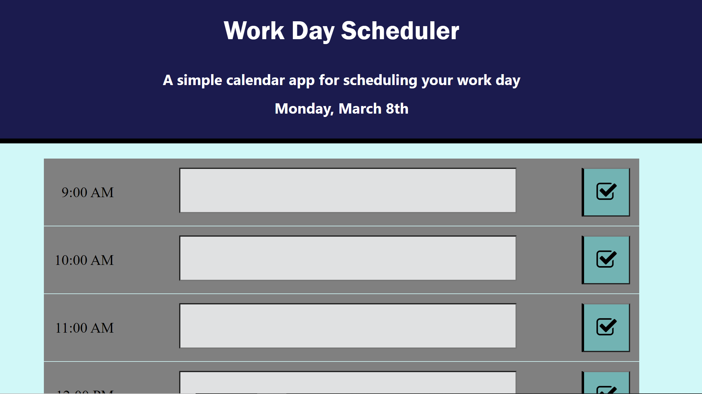

# Daily-Scheduling-Program

This program is a work planning tool. When the user opens the page, the times will be color coded according to the current time. The current hour will be color coded red, any times before the current hour will be grey, and and upcoming times will be green. The user may enter text into any of the input sections, and then click the save button to store the message in local storage. If the user refreshes the page, the message will load into the input section from local storage. A new message in the same time slot will overwrite any message that is currently stored in that same time slot. If the user clicks the "clear all button", all items in local storage will be removed and the page will refresh. 

Link: 
